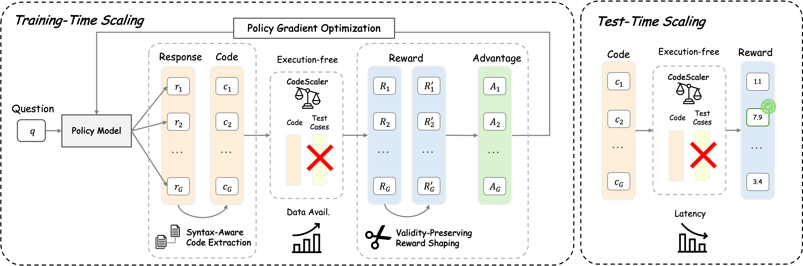

<h2 align="center">
  CodeScaler: Scaling Code LLM Training and Test-Time Inference via Execution-Free Reward Models
</h2>

<p align="center">
  <a href="https://arxiv.org/abs/2602.17684">
    
  <a href="https://github.com/LARK-AI-Lab/CodeScaler">
    
  </a>
  <a href="https://lark-ai-lab.github.io/codescaler.github.io/">
    
  </a>
  <a href="https://huggingface.co/collections/LARK-Lab/codescaler">
    
  </a>
  <a href="https://huggingface.co/collections/LARK-Lab/codescaler">
    
  </a>

  
</p>

## 📊 Overview

<p align="center">
  
</p>

- We propose **CodeScaler**, an execution-free reward model designed to scale both reinforcement learning training and test-time inference for code generation. **CodeScaler** is trained on carefully curated preference data derived from verified code problems and incorporates syntax-aware code extraction and validity-preserving reward shaping to ensure stable and robust optimization. 

- Across five coding benchmarks, **CodeScaler** improves Qwen3-8B-Base by an average of **+11.72** points, outperforming binary execution-based RL by **+1.82** points, and enables scalable reinforcement learning on synthetic datasets without any test cases. 

- At inference time, **CodeScaler** serves as an effective test-time scaling method, achieving performance comparable to unit test approaches while providing a **10×** reduction in latency. Moreover, **CodeScaler** surpasses existing reward models on RM-Bench not only in the code domain but also in general and reasoning domains.


## News
- **[2026-02]** 🎉 We have released the CodeScaler [Paper](https://arxiv.org/abs/2602.17684) on Arxiv!


- **[2026-02]** 🎉 We have released the [code](https://github.com/LARK-AI-Lab/CodeScaler), [dataset](https://huggingface.co/collections/LARK-Lab/codescaler) and [models](https://huggingface.co/collections/LARK-Lab/codescaler) for CodeScaler!


## 📚 Datasets

- [CodeScalerPair-51K](https://huggingface.co/datasets/LARK-Lab/CodeScalerPair-51K): We construct high-quality preference data from on-policy training trajectories.

## 🤖 Models
 We release CodeScaler at different scales from 1.7B, 4B to 8B.
 - [CodeScaler-1.7B](https://huggingface.co/LARK-Lab/CodeScaler-1.7B): A reward model trained on CodeScalerPair-51K from Skywork/Skywork-Reward-V2-Qwen3-1.7B.

  - [CodeScaler-4B](https://huggingface.co/LARK-Lab/CodeScaler-4B): A reward model trained on CodeScalerPair-51K from Skywork/Skywork-Reward-V2-Qwen3-4B.

   - [CodeScaler-8B](https://huggingface.co/LARK-Lab/CodeScaler-8B): A reward model trained on CodeScalerPair-51K from Skywork/Skywork-Reward-V2-Qwen3-8B.

## 🚀 Quick Start

### ⚙️ Environment Setup

The repository is a self-contained [uv](https://docs.astral.sh/uv/) project. uv
manages the Python interpreter (3.10), all dependencies, and FlashAttention from a
single reproducible lockfile (`uv.lock`). This is the recommended path; a manual
conda/pip path is also documented below.

> Requires Linux + an NVIDIA CUDA 12 GPU (the `torch`, `vllm`, `xformers`, and
> `flash-attn` pins are CUDA/Linux-only).

#### Option A — uv (recommended)

```bash
# 1. Install uv (if not already installed)
curl -LsSf https://astral.sh/uv/install.sh | sh

# 2. Clone the repository
git clone https://github.com/LARK-AI-Lab/CodeScaler.git
cd CodeScaler

# 3. Create the environment from the lockfile (installs Python 3.10, all deps,
#    and FlashAttention into a local .venv)
uv sync --frozen
```

That's it — there is no separate FlashAttention step (it is pinned in `pyproject.toml`
to the prebuilt CUDA 12 / torch 2.6 / cp310 wheel). Run any command in the project
environment by prefixing it with `uv run`, e.g. `uv run python data/prepare_deepcoder.py`.
The `scripts/*_uv.sh` scripts are self-contained for this setup: each runs
`uv sync --frozen`, activates the `.venv`, does its work, and tears down its Ray cluster
on exit — so you can run them directly (`bash scripts/train_codescaler_uv.sh`) without
activating anything first. (The plain `scripts/*.sh` variants run in whatever
environment is already active — see *Option B*.)

> 💡 Use `uv sync` (without `--frozen`) only when intentionally changing dependencies;
> it will update `uv.lock`.

#### Option B — conda + pip (manual)

```bash
# 1. Clone
git clone https://github.com/LARK-AI-Lab/CodeScaler.git
cd CodeScaler

# 2. Create a conda environment
conda create -n CodeScaler python==3.10.19
conda activate CodeScaler

# 3. Install dependencies
pip install -r requirements.txt

# 4. Install FlashAttention
pip install --no-cache-dir \
  https://github.com/Dao-AILab/flash-attention/releases/download/v2.7.4.post1/\
flash_attn-2.7.4.post1+cu12torch2.6cxx11abiFALSE-cp310-cp310-linux_x86_64.whl
```

> 💡 **Tip:** You can also install [FlashAttention](https://github.com/Dao-AILab/flash-attention) based on your specific PyTorch and CUDA versions for optimal performance.

### 📦 Data Preparation

Every script comes in two flavors:
- **`scripts/<name>.sh`** — runs in your already-active environment (conda/pip/venv),
  exactly as the upstream repo did. It does not manage dependencies; run it from the
  repo root after installing per *Option B* above.
- **`scripts/<name>_uv.sh`** — self-contained: resolves the repo root, runs
  `uv sync --frozen`, activates the locked `.venv`, then does the same work. Use this
  after the *Option A* (uv) setup; no manual activation needed.

Prepare the training and evaluation datasets:

```bash
bash scripts/prepare_data.sh        # active env
bash scripts/prepare_data_uv.sh     # uv-managed
```

This writes `datasets/DeepCoder/train.parquet` (training) and
`datasets/Evaluation/LiveCodeBench.parquet` (validation) — the files the training
scripts expect — plus the other evaluation benchmarks. Equivalent to running, from the
repo root: `python data/prepare_deepcoder.py`, then `python data/download_data.py`,
then `python data/prepare_evaluation.py`.

> 💡 **Tip:** The training dataset is based on DeepCoder training datasets, and evaluation includes multiple coding benchmarks.

### 🏋️ Training

Train Qwen3-8B-Base on the DeepCoder dataset using a scalar reward model. Two
reward-model families are supported out of the box, each with its own script:

```bash
# Login to Weights & Biases for experiment tracking
wandb login

# Train with the CodeScaler-8B reward model (active env)
bash scripts/train_codescaler.sh
# ...or the uv-managed variant:
bash scripts/train_codescaler_uv.sh

# Train with a Themis reward model (project-themis/Themis-RM-{0.6B,1.7B,4B,8B,14B,32B})
bash scripts/train_themis.sh        # active env
bash scripts/train_themis_uv.sh     # uv-managed
```

> 💡 The `*.sh` and `*_uv.sh` variants run the identical recipe; only the env handling
> differs (`*_uv.sh` adds `uv sync --frozen` + venv activation). Both stop their Ray
> cluster on exit. Extra args are forwarded to the recipe as Hydra overrides, e.g.
> `bash scripts/train_codescaler.sh trainer.total_training_steps=10`. The 4-node
> Themis-RM-32B run uses `scripts/train_themis_32b_multinode.sh` (active env) or
> `scripts/train_themis_32b_multinode_uv.sh` (uv); see the Multi-Node Training section.

The two scripts share the same recipe and differ only in `reward_model.model.path`.
The reward-model architecture is selected automatically from that path inside
`CodeScalerRewardModelWorker` (case-insensitive substring match on `codescaler` /
`themis` / `acecoderm`); an unrecognized path raises a `ValueError`. The Themis
models are scored with their functional-correctness system prompt and their own chat
template (see `scripts/train_themis.sh` for details).

> 💡 **Tip:** Check the `scripts/train_*.sh` files to customize hyperparameters such as learning rate, batch size, and training epochs.

#### Multi-Node Training (AWS, 4 × 8 GPUs)

`scripts/train_themis_32b_multinode.sh` (active env) and its uv-managed counterpart
`scripts/train_themis_32b_multinode_uv.sh` run the colocated (hybrid-engine) recipe
across **4 nodes × 8 GPUs = 32 GPUs**, training Qwen3-8B-Base against the 32B Themis
reward model (`project-themis/Themis-RM-32B`). The same pattern works for any reward
model — just change `rm_path`. The launch commands below use the `_uv` variant; drop
the `_uv` suffix to run in an already-active environment.

**How it scales.** The only required config change for multi-node is
`trainer.nnodes` (here `4`). With `reward_model.enable_resource_pool=False` (default),
the policy and the reward model are *colocated*: one Ray worker per GPU holds a shard
of both models across all 32 GPUs, and they time-share each GPU (rollout → log-prob →
reward scoring → GRPO update).

**Ray vs. torch master.** The IP/port you pass is the **Ray head** address (used to
join the nodes into one cluster). VeRL derives the `torch.distributed`
`MASTER_ADDR`/`MASTER_PORT` automatically from the rank-0 worker's placement group —
you do **not** set those yourself.

**Launch.** Start the workers first, then the head (the head waits until all 32 GPUs
register, then launches the driver; workers only host Ray actors):

```bash
# On each of the 3 WORKER nodes:
HEAD_IP=<head-private-ip> HEAD_PORT=6379 ROLE=worker bash scripts/train_themis_32b_multinode_uv.sh

# On the HEAD node:
HEAD_IP=<head-private-ip> HEAD_PORT=6379 ROLE=head   bash scripts/train_themis_32b_multinode_uv.sh
```

**FSDP sharding.** `fsdp_size` controls the device mesh and is applied to both the
actor and the reward model:
- `fsdp_size=8` → `HYBRID_SHARD`: shard within each node's 8 GPUs (intra-node NVLink),
  replicate across the 4 nodes. Faster, but more per-GPU memory.
- `fsdp_size=-1` → `FULL_SHARD` across all 32 GPUs: least per-GPU memory, but every
  parameter all-gather crosses the inter-node fabric.

**AWS networking.** Multi-node FSDP collectives need EFA/NCCL configured (not part of
the recipe). The script sets `FI_PROVIDER=efa`, `FI_EFA_USE_DEVICE_RDMA=1`,
`NCCL_SOCKET_IFNAME` (adjust to your ENI), and `NCCL_DEBUG=INFO`. Your security group
must allow the Ray ports between nodes **and** all traffic within the SG itself
(self-referencing rule) for EFA/NCCL. Pre-stage model weights on a shared FSx/EFS
mount or bake them into the AMI so all nodes don't each re-download (the 32B RM is
~64 GB).

**Running out of memory?** Levers in rough order of impact (full list documented at
the bottom of the script):
1. **Give the reward model its own nodes** — `reward_model.enable_resource_pool=True`
   with `reward_model.nnodes` / `reward_model.n_gpus_per_node` (e.g. 3 policy nodes +
   1 RM node). Biggest win: the 32B RM stops competing for policy memory.
2. **`fsdp_size=-1`** (FULL_SHARD across all 32 GPUs) — lowest per-GPU footprint.
3. **Lower `actor_rollout_ref.rollout.gpu_memory_utilization`** (e.g. 0.7 → 0.5) to
   shrink vLLM's reserved KV cache.
4. **`actor_rollout_ref.rollout.tensor_model_parallel_size=2/4`** to shard the policy
   in vLLM.
5. **Cut activations** — lower `ppo_max_token_len_per_gpu`, micro-batch sizes,
   `reward_model.max_length`, or `data.max_response_length`.

> ⚠️ The reward model is CPU-offloaded by the worker. Under `HYBRID_SHARD` each node's
> host RAM holds a full bf16 copy of the 32B RM (~64 GB) plus the actor's offloaded
> state — comfortable on p4d/p5-class hosts; on smaller-RAM instances prefer
> `fsdp_size=-1` to spread the offload.

> 📖 **Full reference:** [`recipe/codescaler/REWARD_MODELS.md`](recipe/codescaler/REWARD_MODELS.md)
> documents the complete reward-model pipeline — reward flow, family selection
> (CodeScaler / Themis / AceCoder), input formatting and chat templates, score
> read-out, GPU placement (colocated vs. dedicated pool), FSDP sharding modes,
> multi-node setup, the full out-of-memory lever list, and how to add a new RM
> family.

### 📈 Evaluation

Evaluate your trained model:

```bash
# Run evaluation on benchmarks
bash scripts/eval.sh        # active env
bash scripts/eval_uv.sh     # uv-managed
```

### 💻 Use CodeScaler for RM Scoring
````python
import torch
from transformers import AutoTokenizer, AutoModelForSequenceClassification

device = "cuda" if torch.cuda.is_available() else "cpu"
model_path = 'LARK-Lab/CodeScaler-8B'

tokenizer = AutoTokenizer.from_pretrained(model_path)
reward_model = AutoModelForSequenceClassification.from_pretrained(model_path).to(device)
reward_model.eval()

question = """\
Given an integer array nums and an integer k, return the total number of continuous subarrays whose sum equals k.
A subarray is a contiguous part of the array.
For example:
```
Input:
nums = [1, 1, 1], k = 2

Output:
2
```
"""

# Correct solution using prefix sum approach
program_correct = """\
from collections import defaultdict

def subarraySum(nums, k):
    prefix = 0
    count = 0
    freq = defaultdict(int)
    freq[0] = 1  # Important: subarray starting from index 0

    for num in nums:
        prefix += num

        if prefix - k in freq:
            count += freq[prefix - k]

        freq[prefix] += 1

    return count
"""

# Incorrect solution using sliding window (fails on negative numbers)
program_wrong = """\
def subarraySum(nums, k):
    left = 0
    curr_sum = 0
    count = 0

    for right in range(len(nums)):
        curr_sum += nums[right]

        while curr_sum > k and left <= right:
            curr_sum -= nums[left]
            left += 1

        if curr_sum == k:
            count += 1

    return count
"""


convs = [
    [
        {
            "content": question,
            "role": "user",
        },
        {
            "role": "assistant",
            "content": program
        }
    ] for program in [program_correct, program_wrong]
]


texts = [
    tokenizer.apply_chat_template(conv, tokenize=False)
    for conv in convs
]

toks = tokenizer(
    texts,
    truncation=True,
    padding=True,
    max_length=2048,
    return_tensors="pt",
)

with torch.no_grad():
    outputs = reward_model(
        input_ids=toks["input_ids"].to(device),
        attention_mask=toks["attention_mask"].to(device),
    )
    scores = outputs.logits.squeeze(-1).cpu().tolist()


print("RM Scores:", scores)
# RM Scores: [6.5424089431762695, -0.0312652587890625]
````


## Citation
If you find our work helpful, please consider citing:
```
@misc{zhu2026codescalerscalingcodellm,
      title={CodeScaler: Scaling Code LLM Training and Test-Time Inference via Execution-Free Reward Models}, 
      author={Xiao Zhu and Xinyu Zhou and Boyu Zhu and Hanxu Hu and Mingzhe Du and Haotian Zhang and Huiming Wang and Zhijiang Guo},
      year={2026},
      eprint={2602.17684},
      archivePrefix={arXiv},
      primaryClass={cs.LG},
      url={https://arxiv.org/abs/2602.17684}, 
}
```

